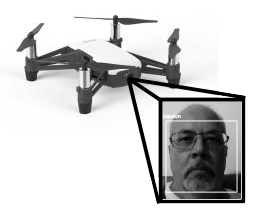
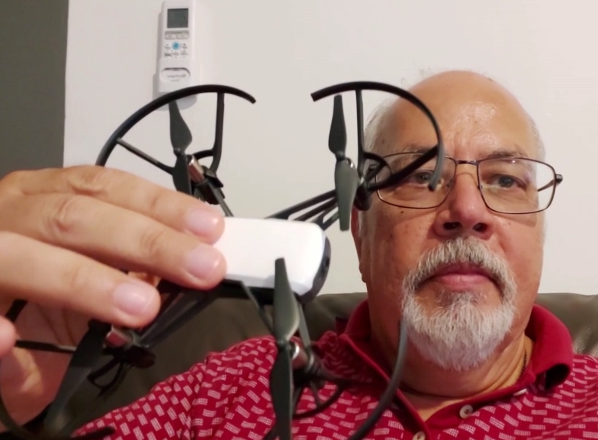
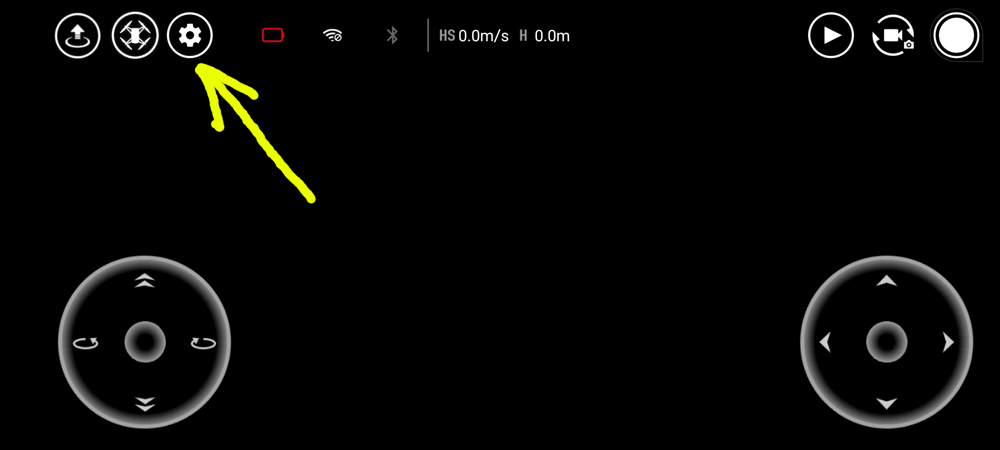
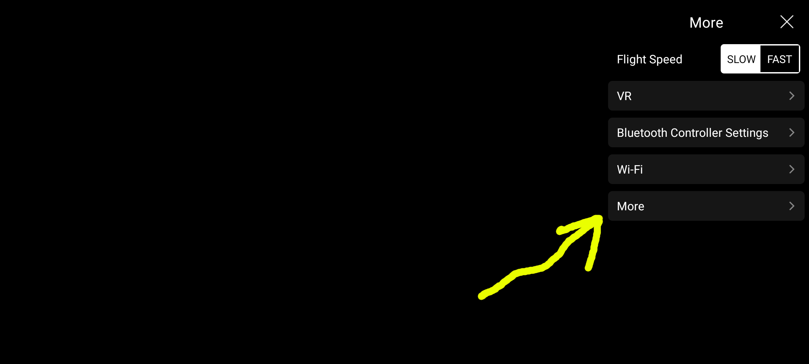
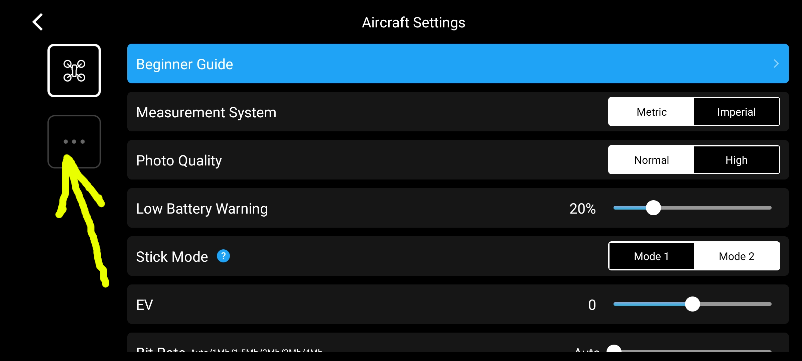
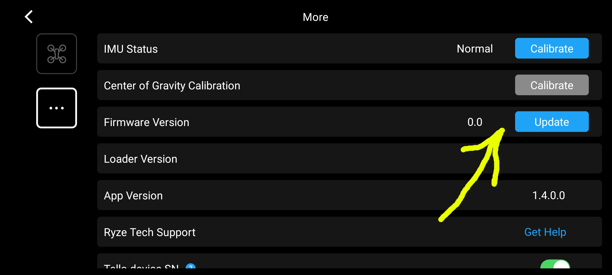

# Drone Facerec
[**Cleuton Sampaio**](https://github.com/cleuton), Março de 2020
My [**LinkedIn** profile](https://www.linkedin.com/in/cleutonsampaio/).



[**ENGLISH VERSION HERE**](./english_version.md)

[](https://www.lcm.com.br/site/#livros/busca?term=cleuton)

**clique na imagem para assistir a uma demonstração em vdeo (click on the image to watch a vide demo)**
[](https://youtu.be/rYlRKvWnsSc)

Uma demonstração de reconhecimento facial utilizando [**Keras**](https://keras.io/), [**ensorflow**](https://www.tensorflow.org/), python e o drone [**Tello**](https://store.dji.com/shop/tello-series), da **DJI**.

Este projeto é baseado em dois outros projetos do Github: 

1. [**FaceREC - CNN implementation of facial recognition**](https://github.com/cleuton/facerec_cnn), criado por [**mim**](https://github.com/cleuton);
2. [**EasyTello**](https://github.com/Virodroid/easyTello), criado por **Ezra Fielding**.

## Visão geral

Eu rodei isso no **Ubuntu** (Linux). Para rodar em **MS Windows** ou **MacOS** é necessário alterar algumas coisas. Você está convidado a fazer isso e depois submeter um **pull request**.

Este software controla um drone Tello, capturando o vídeo streaming gerado por sua câmera de bordo. Ele intercepta cada frame e tenta reconecer rostos que aparecem na imagem, utilizando um modelo de rede [**Convolucional**](https://github.com/cleuton/FaceGuard/tree/master/CNN) que eu treinei, baseado em imagens do dataset  [**Labeled Faces in the Wild**](http://vis-www.cs.umass.edu/lfw/), e algumas fotos minhas. 

É uma prova de conceito do uso de inteligência artificial com drones e, por que não, de Internet das Coisas (IoT). Note que a performance pode ser baixa, afinal de contas, estou usando um laptop e um drone barato e simples. Com mais recursos, é possível obter melhor desempenho da solução.

Para usar essa solução, você precisará: 

1. De um drone [**Tello**](https://store.dji.com/shop/tello-series), com Firmware 1.4 ou superior;
2. De um modelo de reconhecimento facial, gerado pelo projeto [**FaceRec_CNN**](https://github.com/cleuton/facerec_cnn);
3. Do arquivo de predição de face do Dlib: [shape_predictor_68_face_landmarks.dat](https://github.com/davisking/dlib-models) (veja no [FaceRec_CNN](https://github.com/cleuton/facerec_cnn));

Eu vou te ensinar a fazer essas 3 coisas. 

## Antes de usar

Há algumas coisas que você precisa fazer antes de usar esta aplicação. Para começar, ela foi feita exclusivamente para o Drone Tello, mas se aplica a qualquer outro drone que possua uma API de programação python.

A primeira coisa a fazer é conseguir controlar seu drone usando apenas o [**easyTello**](https://github.com/Virodroid/easyTello) original e depois tentar usar este projeto aqui. Por que? Bem, não é tão simples quanto parece...

Se você acabou de comprar seu drone Tello, precisa verificar qual é a versão do **Firmware** dele. Isso pode ser feito através da app [**Tello**](https://www.ryzerobotics.com/tello) (se não baixou, é melhor fazer logo).

Primeiramente, ligue o drone, conecte-se à rede WiFi dele com seu Smartphone (TELLO...), abra a app e clique no botão de configurações, como na imagem: 



Depois, clique em **More**: 



Clique no botão com três pontos: 



Agora, verifique o número da versão do firmware. Se estiver como 1.3 (alguma coisa), é preciso atualizar para 1.4!



O processo é feito em duas partes: Baixar o firmware para o Smartphone e atualizar no drone. Para baixar a nova versão do firmware, desconecte do WiFi do drone e conecte à Internet. Usando a app do Tello, clique no botão **Update** para baixar o firmware. Depois que baixar, conecte-se ao WiFi do drone e clique novamente no botão **Update**.

Depois do processo, verifique a nova versão do firmware. 

**Atenção**: Um indício que a API está desatualizada é quando o drone não reconhece o comando **streamon**!

Se você atualizou corretamente o firmware, eu recomendo que tente rodar o [**easyTello**](https://github.com/Virodroid/easyTello) original, seguindo as instruções no repositório dele. Com isso, você confirma que a API de controle está funcionando corretamente. Depois, pode baixar e rodar este repositório aqui. 

Isso feito, clone este repositório e crie um ambiente [**Anaconda**](https://anaconda.org/) usando o script [**conta-env.yml**](./conda-env.yml): 

```
conda env create -f conda-env.yml
```

Ative o ambiente antes de usar este software: 

```
conda activate drone-facerec
```

## Criando um arquivo de modelo

Para fazer o reconhecimento facial, é necessário treinar uma rede neural. Eu não inseri o projeto [**FaceREC**](https://github.com/cleuton/facerec_cnn) aqui, nem mesmo o arquivo de modelo que eu treinei. Recomendo que você clone o projeto original e treine seu modelo, copiando o arquivo **HDF5** criado para a pasta **easyTello**, dentro deste projeto. 

Baixe e extraia o arquivo [**shape_predictor_68_face_landmarks**](http://dlib.net/files/shape_predictor_68_face_landmarks.dat.bz2) file, e coloque no projeto FaceRec_CNN e dentro da pasta **easytello** deste projeto!

Gerar um modelo é simples: 

1. **Obtenha várias fotos do rosto da mesma pessoa**:
    1. Use o [**Labeled Faces in the Wild**](http://vis-www.cs.umass.edu/lfw/) e baixe várias fotos da mesma pessoa, copiando para a pasta **raw** do projeto FaceRec_CNN;
    2. Nomeie os arquivos neste padrão: fulano-de-tal.nnnn.jpg (não use espaços, numere fotos do mesmo sujeito, separando por pontos). Por exemplo: "bill-clinton.0001.jpg";
    3. Tire várias fotos do seu rosto (e de quem mais deseja reconhecer) e salve na pasta **raw** seguindo a mesma nomenclatura do passo "1/2";
    4. Cuide para que haja apenas um único rosto em cada foto de treinamento! Se houver mais de um rosto, corte a foto;

2. **Converta as fotos**: 
    1. O script **trainCNN.py** vai rotacionar e cortar os rostos, transformando em imagens monocromáticas. Ele vai separar em fotos de treino e de teste (pastas "train" e "test") de acordo com a variável **train_test_ratio = 0.3**. Se mantiver em 30%, então 70% das imagens serão para treino e as outras para teste;
    2.Anote as categorias encontradas! O programa exibirá um vetor com os nomes encontrados. Anote para mudar no script de predição (**predict.py**) e no script de reconhecimento deste projeto [**faceprocessor.py**](./easytello/faceprocessor.py);
    3. Se houver 4 pessoas na sua pasta **raw**, ele tem que separar 4 pessoas em **train** e 4 pessoas em **test**. Com poucas imagens, pode acontecer de ficarem menos pessoas em **test** e isso dará erro.

3. **Obtenha os nomes das pessoas e o arquivo de modelo**: 
    1. Os nomes das pessoas são exibidos na console, após o treinamento. Copie esse vetor e altere no **faceprocessor.py**; 
    2. O arquivo de modelo terá o nome **'faces_saved.h5'** copie-o para a pasta **easytello** deste projeto;


Antes de testar com o drone de verdade, eu sugiro que você teste aos poucos. Verifique se consegue capturar vídeo da sua WebCam: 

```
ffmpeg -f video4linux2 -s 640x480 -r 15 -i /dev/video0 -vcodec libx264 -f  h264 -an udp://localhost:11111
```

Use o programa que eu incluí [**facetest_ffmpeg.py**](./facetest_ffmpeg.py) para capturar as imagens e fazer o reconhecimento. Se tudo funcionar, se ele te reconhecer, então está tudo pronto para rodar no Drone. 

Se quiser, pode rodar: 

```
python teste.py
```
E testar com o streaming gerado pelo **FFMPEG**. 

## Controlando o drone

**Atenção**: Para fazer o reconhecimento facial, não use o projeto Easytello original! Eu modifiquei o projeto para se comunicar com meu script de reconhecimento facial [**faceprocessor.py**](./easytello/faceprocessor.py).

O script [**teste.py**](./teste.py) controla o drone. Ele faz basicamente 2 coisas: coloca em modo comando e inicia a captura de vídeo. Mas você pode fazer muito mais! Pode fazer o drone decolar, ir para a frente, ou virar e depois pousar. Há alguns comandos comentados que você pode usar. Se quiser saber mais sobre os comandos que o Tello aceita, [**veja na documentação**](https://dl-cdn.ryzerobotics.com/downloads/Tello/Tello%20SDK%202.0%20User%20Guide.pdf).

**Atenção**: Não tente conectar com a app do seu smartphone ao drone, pois ele só atende a uma única conexão!

Certifique-se de haver colocado o arquivo **h5** na pasta easyTello! Certifique-se de que o nome esteja igual como está no arquivo [**faceprocessor.py**](./easytello/faceprocessor.py)

**Atenção**: Se você fizer o drone decolar, tenha certeza de haver espaço para isso! Se ele bater no teto ou nas paredes, pode ficar danificado! E cuidado ao tentar usar o Tello no ambiente externo (não recomendável). Se ele se afastar por mais de 10 metros, pode ficar fora do alcance do WiFi e colidir com alguma coisa. Teoricamente, se ele perder o contato, ele pousa automaticamente. 


